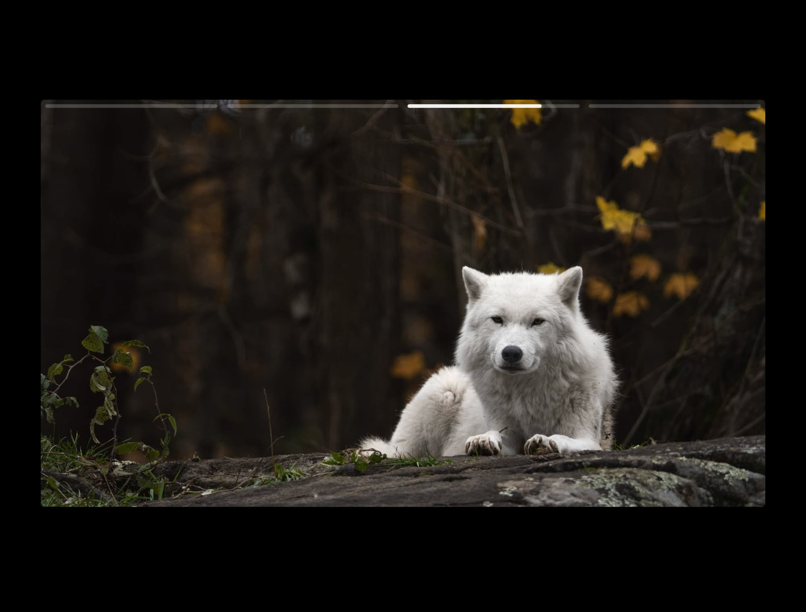

# Projeto de conclusão de curso TypeScript para Iniciantes origamid

## 👩‍💻 About the project

O projeto é um slides do tipo stories feito em javascript vanilla com typescript.
Onde ao clicar/touch e segurar ele pausa, ao soltar continua, com opção de fotos e videos.

Além de botão para clicar e voltar. eg click direta = next, click esquerda = prev
